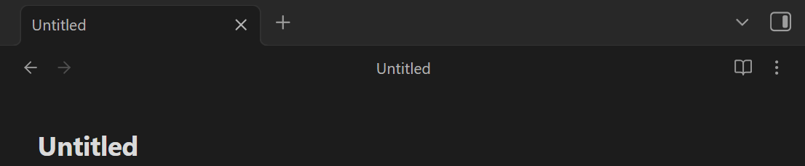
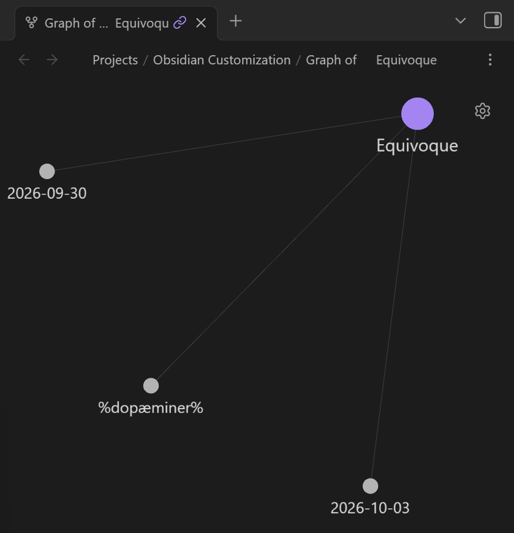
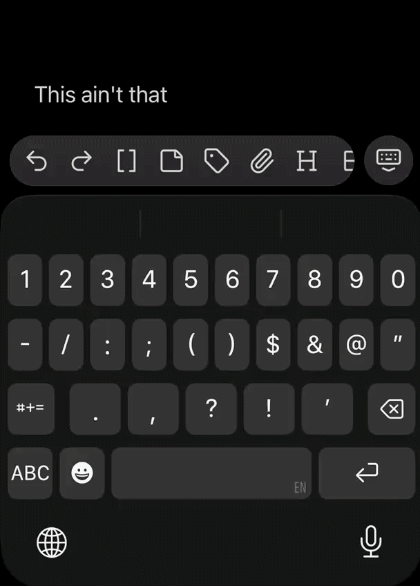
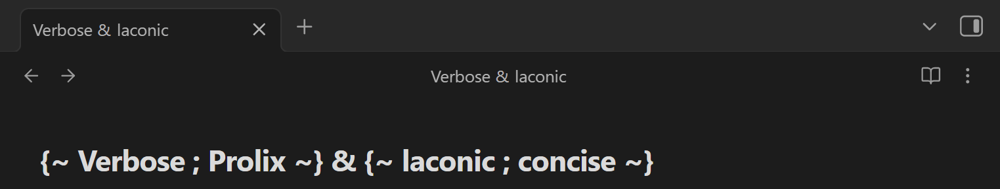
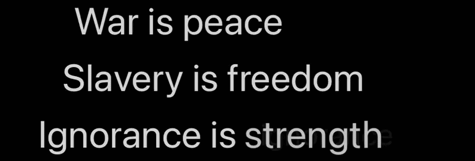

# Metamorpheme

**Superpose meanings that coincide. Equivocal by design.**




> Linguistically, we like to think words have strict definitions. But in actual communication, words function exactly like clouds of states. They exist in superposition until context forces them to resolve.

  


One node ≠ one name. See the point ?



  


Let them brain wave functions flow w/0 collapse w one tap of the button at your fingertips among tooltips 



  


Align your means of expression within expanded limitations





  


Preserve unique markdown per morpheme or wrap the whole metamorpheme in one


## Syntax

```
{~ hold=2 fade=1 align=left style=crossfade ; Leave ; Make @1.5/0.4 ; Find @3 ~} space for what one word couldn't carry.
```

- Keep a space after `{~` and before `~}`.
- `word @H` — this word stays H seconds before the next one fades in.
- `word @H/F` — same, and the morph into the next word takes F seconds.
- `word @/F` — only override the fade.
- First segment `hold= fade= style= align=` sets defaults for that set (`align`: left | center | right | justify). `justify` stretches shorter morphemes to the width of the longest one in the set.
- Styles: `zoom`, `diffuse`, `slide`, `crossfade`. The default is chosen in plugin settings; `style=` overrides it per set.

